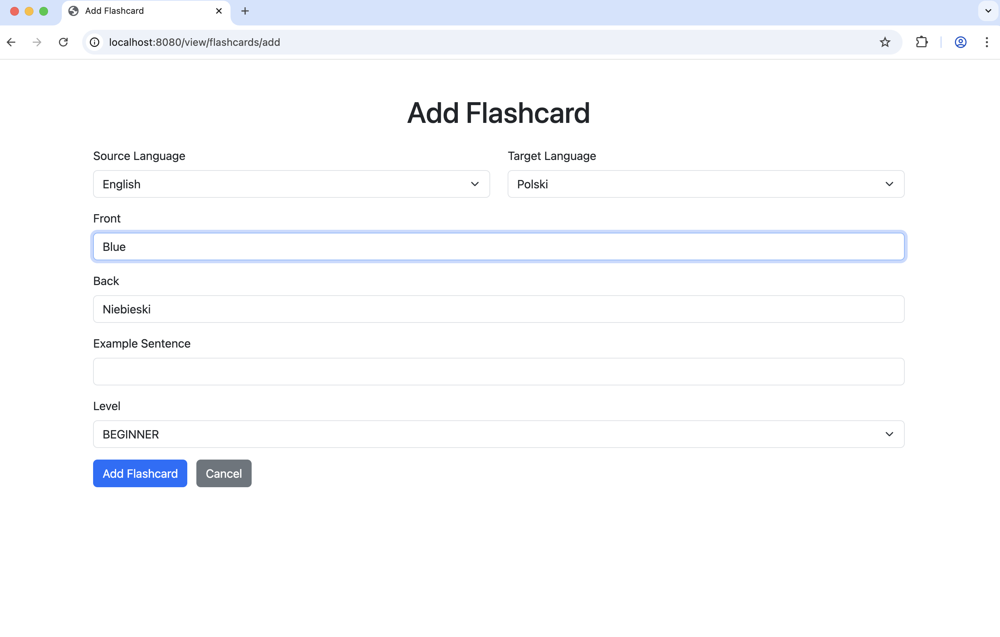

# Liguaflash

**Liguaflash** application was designed to help with learning languages. Key features of the application include:

- Creating flashcards with auto translation
- Joining flashcards in custom decks
- Creating user's own decks
- Learning mode with rotatable flashcards
- Measuring usage statistics for decks

This Spring Boot application provides two types of endpoints – **REST API** returning JSON responses and 
**Web View** endpoints rendering HTML via Thymeleaf templates (for browser-based UI).

## Installation
**Liguaflash** application is written in Spring Boot. In Docker, only the MySQL database is started, 
the application itself runs locally. 

To run:
1. Clone the repository
    `git clone https://github.com/asuwinsk/linguaflash/.git`
    `cd Liguaflash`

2. Start MySQL DB in Docker
    `docker-compose up -d`

DB connection details:
host: localhost
port: 3306
user: root
password: root
database: mydb

2.	Run the Application
    Run locally with:  `./mvnw spring-boot:run` or use IDE.

Application will be available at:
http://localhost:8080

##Technologies
- Java 17
- Spring Boot
- Spring Data JPA (Hibernate)
- MySQL DB
- Jackson
- Docker
- Thymeleaf
- Maven

##User flow
1. List of available flashcards
   
   This page enables to perform CRUD operations for flashcards.

2. Adding flashcards with auto translation
    
    When the Front field is filled, the Back field populates automatically with the translation.

3.	List of decks
    
    Switching to a view deck endpoint get an access to perform CRUD operations for decks. From here 
    user has access to learning mode for a selected deck.

4.	View deck
    
    This page shows the deck details. 

5.	View flashcards in specific deck
    
    This page enables to add or delate flashcards for that deck. 

6.	Adding flashcards to deck
    
    Filter by source/target languages and multi-select flashcards from a range.

7.	Learning mode
    
    By clicking ‘Let’s Learn!’ in View flashcards, user can test knowledge by rotating flashcards. Firstly, 
    showing Front and then Back with example sentence and level. User can navigate with Next/Previous, 
    draw random flashcards, or reset to start over.